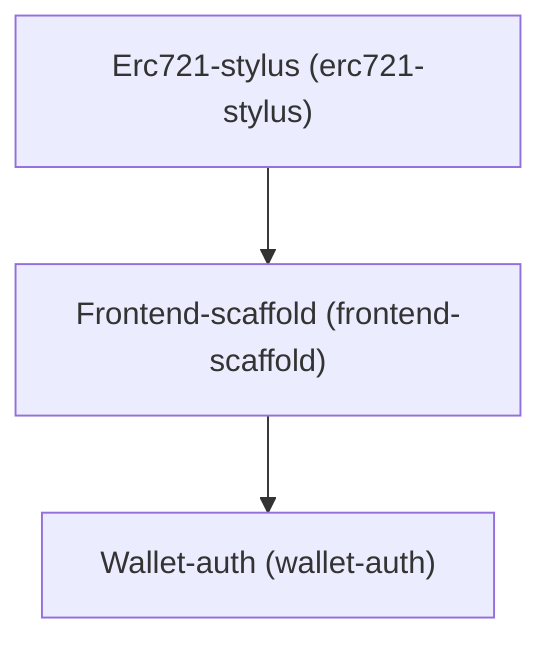

# Architecture

## Dependency Graph

```mermaid
graph TD
  79893bea["Erc721-stylus (erc721-stylus)"]
  d672ee32["Frontend-scaffold (frontend-scaffold)"]
  66a4446e["Wallet-auth (wallet-auth)"]
  79893bea --> d672ee32
  d672ee32 --> 66a4446e
```

## Execution / Implementation Order

1. **Erc721-stylus** (`79893bea`)
2. **Frontend-scaffold** (`d672ee32`)
3. **Wallet-auth** (`66a4446e`)
